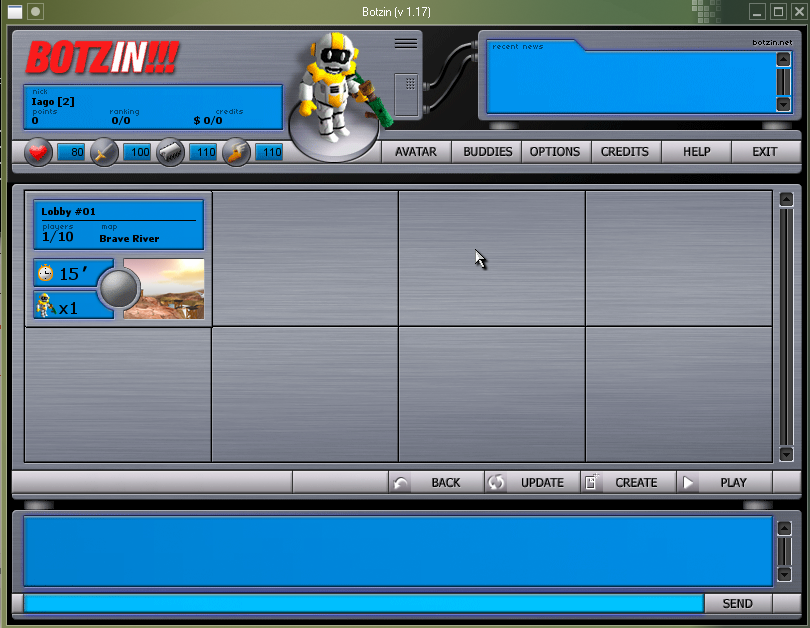
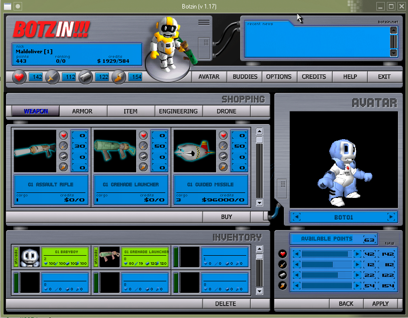
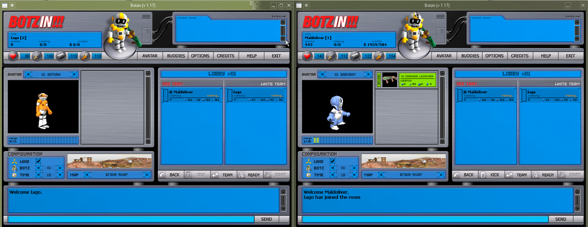
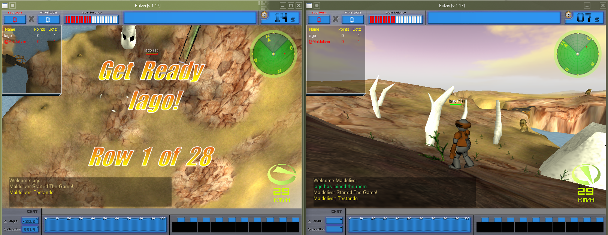

# Botzin.OpenMASE
Reimplementação/emulador de servidor do finado MMO brasileiro Botzin!!! da Green Land Studios. 

  
  

  
  

 

# Funcionalidades
- [x] <b>Criptografia (MD5/XTEA)</b>
- [x] <b>Autenticação (Login/Cadastro)</b>
- [x] <b>Inventário (Avatar/Loja)</b>
- [x] <b>MasterServer (Lista de Lobby)</b>
- [ ] Progressão (Pontuação por Rounds, XP, etc...)
- [x] <b>Broadcasts (Anûncios Globais)</b>
- [ ] Buddylist (Lista de Amigos)

 

# Protocolos Suportados
<b>Oficialmente</b>, o <i>OpenMASE</i> suporta as versões <b>1.03</b> (Beta) e <b>1.17</b>. (Última versão lançada)

 

# Licença
OpenMASE é <i>software</i> livre: você pode redistribuir e/ou modificar o código seguindo os termos da <i>GNU General Public License (v3)</i> assim como escrito pela <i>Free Software Foundation</i>.

 

# Disclaimer

Botzin!!! é propriedade intelectual da Green Land Studios fundada por Wagner Carvalho e Vitor Rodrigues. 
 
<i>OpenMASE</i> foi desenvolvido de forma totalmente independente através da engenheria reversa do(s) cliente(s) do jogo em fins <b>não monetários</b> de preservação de <i>abandonware</i>.
